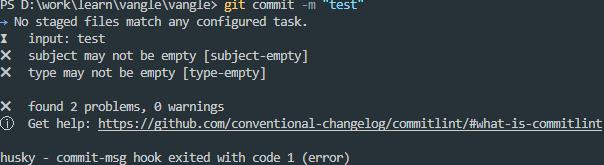

# 手把手从零搭建一个 vue3 组件库 (一)

这篇文章会带着你从零搭建一个基于 vue3 的组件库。

[github 地址](https://github.com/vangleer/vangle)

[gitee 地址](https://gitee.com/vangleer/vangle)

话不多说，开搞

## 项目搭建

- 新建 vangle 项目
- cd vangle 进入项目
- pnpm init -y 初始化 package.json 文件，没安装 pnpm 的需要提前安装一下

```
npm i pnpm -g
```

- 新建 packages 目录，里面存放我们要开发的项目，例如 components、cli 等
- 创建 pnpm-workspace.yaml 文件，并指定 packages

```yaml
# pnpm-workspace.yaml
packages:
  - 'packages/*'
```

- 安装 typescript 并初始化 tsconfig.json 文件

```shell
# -w 表示在要把包下载到根目录
pnpm add typescript -D -w
npx tsc --init
```

- 想配啥配啥

```json
{
  "compilerOptions": {
    "baseUrl": ".",
    "target": "es2016",
    "sourceMap": false,
    "module": "esnext",
    "esModuleInterop": true,
    "strict": true,
    "jsx": "preserve",
    "types": ["node"],
    "rootDir": "."
  }
}
```

## 添加代码规范

### prettier

- 安装依赖

```
pnpm add prettier -D -w
```

- 根目录创建 .prettierrc.js

```javascript
module.exports = {
  semi: false,
  singleQuote: true,
  printWidth: 80,
  trailingComma: 'none',
  arrowParens: 'avoid'
}
```

### eslint

- 安装依赖

```
pnpm add eslint @typescript-eslint/parser @typescript-eslint/eslint-plugin -D -w
```

#### 配合 prettier

当 ESLint 的规则和 Prettier 的规则相冲突时，就会发现一个尴尬的问题，用其中一种来格式化代码，另一种就会报错。prettier 官方提供了一款工具 eslint-config-prettier 来解决这个问题，本质上这个工具其实就是禁用掉了一些不必要的以及和 Prettier 相冲突的 ESLint 规则。

- 安装依赖

```
pnpm add eslint-config-prettier eslint-plugin-prettier -D -w
```

- 根目录创建 .eslint.js

```javascript
module.exports = {
  parser: '@typescript-eslint/parser',
  extends: [
    'eslint:recommended',
    'plugin:@typescript-eslint/recommended',
    'prettier',
    'plugin:prettier/recommended'
  ],
  env: {
    browser: true,
    es2021: true
  },
  extends: ['eslint:recommended'],
  plugins: ['@typescript-eslint', 'prettier'],
  parserOptions: {
    ecmaVersion: 'latest',
    sourceType: 'module'
  },
  rules: {
    'prettier/prettier': 'error',
    'no-extra-semi': 'off',
    '@typescript-eslint/camelcase': 'off',
    '@typescript-eslint/ban-ts-ignore': 'off',
    '@typescript-eslint/no-var-requires': 'off',
    '@typescript-eslint/no-extra-semi': 'off',
    '@typescript-eslint/no-explicit-any': 'off',
    '@typescript-eslint/no-empty-function': 'off',
    '@typescript-eslint/no-non-null-assertion': 'off',
    '@typescript-eslint/explicit-function-return-type': 'off',
    '@typescript-eslint/explicit-module-boundary-types': 'off',
    '@typescript-eslint/no-empty-interface': 'off'
  }
}
```

- package.json 中添加执行命令

```json
"scripts": {
  "prettier": "prettier --write .",
  "lint": "eslint --ext .ts packages/*/**.ts",
  "lint:fix": "eslint --ext .ts packages/*/**.ts --fix"
},
```

这时我们可以在 packages 下创建 components/index.ts，写一些不符合规则的代码然后运行命令试试效果

### husky + lint-staged

> husky 哈士奇，代码提交前可以执行自定义 git hooks

> 在代码提交之前，进行代码规则检查能够确保进入 git 库的代码都是符合代码规则的。但是整个项目上运行 lint 速度会很慢，lint-staged 能够让 lint 只检测暂存区的文件，所以速度很快。

- 安装依赖

```
pnpm add husky lint-staged -D -w
```

- 执行 **npx husky install** 创建.husky 目录，该目录下有一个 pre-commit 文件在每次提交代码的时候会执行，可以修改里面的运行脚本，自定义提交需要做的工作，如果没有 pre-commit 文件可以手动创建

```shell
#!/bin/sh
. "$(dirname "$0")/_/husky.sh"

npx lint-staged
```

- 在 package.json 中添加 lint-staged 配置

```json
{
  "lint-staged": {
    "*.{js,jsx,vue,ts,tsx}": [
      "eslint --ext .ts packages/*/**.ts", // 这里也可以写我们上面定义好的命令，如：pnpm lint
      "eslint --ext .ts packages/*/**.ts --fix" // 这里也可以写我们上面定义好的命令，如：pnpm lint:dix
    ]
  }
}
```

> 现在我们可以试着提交一下代码，如果不符合 eslint 校验规则的会自动修复，修复完成后需要再次提交

### commitlint

> commitlint 统一提交时的 message，[官方文档](https://commitlint.js.org/#/guides-local-setup)

- 安装依赖

```shell
pnpm add @commitlint/config-conventional @commitlint/cli -D -w
```

- 根目录新建 commitlint.config.js

```javascript
module.exports = {
  extends: ['@commitlint/config-conventional']
}
```

- 添加钩子 .husky/commit-msg

```shell
#!/bin/sh
. "$(dirname "$0")/_/husky.sh"

npx --no-install commitlint --edit $1
```

现在我们试着提交一下代码

```
git add .
git commit -m "test"
```

由于 "test" 不符合提交格式，所以不会通过



我们再试着使用正确的规则提交，不出意外能成功。。。

```
git commit -m "style: commitlint"
```

到此我们项目搭建和代码规范以完毕，目录结构如下

```
|-- vangle
    |-- .eslintrc.js
    |-- .gitignore
    |-- .prettierrc.js
    |-- commitlint.config.js
    |-- package.json
    |-- pnpm-lock.yaml
    |-- pnpm-workspace.yaml
    |-- README.md
    |-- tsconfig.json
    |-- .husky
    |   |-- commit-msg
    |   |-- pre-commit
    |   |-- _
    |       |-- .gitignore
    |       |-- husky.sh
    |-- packages
        |-- components
            |-- index.ts
```

## 编写一个组件

### 组件环境

- 在 packages 下新建 components 并初始化 package.json

```json
// packages/components/package.json
{
  "name": "@vangle/components",
  "version": "1.0.0",
  "description": "all components are settled here",
  "main": "index.ts",
  "module": "index.ts",
  "unpkg": "index.js",
  "jsdelivr": "index.js",
  "scripts": {},
  "keywords": [],
  "author": "",
  "license": "ISC",
  "peerDependencies": {
    "vue": "^3.2.0"
  },
  "types": "index.d.ts"
}
```

- 项目根目录安装 vue 和 vite 依赖，安装 vite 依赖会有 define/\* 提示。

```
pnpm add vue vite unplugin-vue-define-options -D -w
```

- unplugin-vue-define-options 可以在编写组件的时候 通过 defineOptions 方法为组件设置 name

```javascript
defineOptions({
  name: 'PlayButton'
})
```

- 修改 tsconfig.json

```json
{
  "compilerOptions": {
    "baseUrl": ".",
    "target": "es2016",
    "sourceMap": false,
    "module": "esnext",
    "esModuleInterop": true,
    "strict": true,
    "jsx": "preserve",
    "lib": ["esnext", "dom"],
    "types": ["node", "unplugin-vue-define-options"],
    "rootDir": ".",
    "moduleResolution": "node",
    "paths": {
      "@valgle/*": ["packages/*"]
    }
  }
}
```

- eslint 添加支持 vue 插件 eslint-plugin-vue

```
pnpm add eslint-plugin-vue -D -w
```

- 修改 .eslintrc.js

```js
module.exports = {
  extends: [
    'eslint:recommended',
    'plugin:vue/recommended', // add
    'plugin:@typescript-eslint/recommended',
    'prettier',
    'plugin:prettier/recommended'
  ],
  plugins: ['@typescript-eslint', 'prettier', 'vue'] // add
}
```

### Button 组件

- 在 packages/components 目录下创建 button 目录，结构如下

> 注意：我们这里只编写一个简单的 button 组件，主要是打通整体流程

```
|-- button
    |-- index.ts
    |-- src
    |   |-- button.ts
    |   |-- button.vue
    |   |-- button.less
    |-- __test__
```

components/button/src/button.vue

```vue
<template>
  <button><slot></slot></button>
</template>

<script lang="ts" setup>
defineOptions({
  name: 'VangleButton'
})
</script>
```

components/button/index.ts

```typescript
export * from './src/button'
import type { App } from 'vue'
import Button from './src/button.vue'

Button.install = (app: App) => {
  app.component(Button.name, Button)
}

export { Button }
export default Button
```

components/index.ts 导出

```typescript
export * from './button'
```

## 使用组件

- 在根目录 package.json 中添加 组件的依赖

```json
{
  "devDependencies": {
    "@vangle/components": "workspace:*"
  }
}
```

这里的包名 @vangle/components，就是我们在 pzckages/components/package.json 中设置的 name 属性

- 执行 pnpm install

### play 一下

- 我们可以在根目录创建使用 vite 创建一个项目，请参考 [vite 官网](https://vitejs.dev)，项目名称就叫 play

- 创建完后修改 pnpm-workspace.yaml

```yaml
packages:
  - 'packages/*'
  - 'play' # add
```

- 添加启动命令 package.json

```json
{
  "scripts": {
    "play": "pnpm dev --filter ./play", // add
    "prettier": "prettier --write .",
    "lint": "eslint --ext .ts packages/*/**.ts",
    "lint:fix": "eslint --ext .ts packages/*/**.ts --fix"
  }
}
```

- 最后在 play 项目中使用我们编写的组件即可

> 注意事项：

由于我们处于开发环境，需要给 vite.config.ts 添加 unplugin-vue-define-options/vite 插件

```typescript
import { defineConfig } from 'vite'
import vue from '@vitejs/plugin-vue'
import DefineOptions from 'unplugin-vue-define-options/vite'

// https://vitejs.dev/config/
export default defineConfig({
  plugins: [vue(), DefineOptions()]
})
```

================================= 分割线 =================================

到这里就是本篇文章的全部内容了，如果对大家有用，希望多多支持一下，你们的支持就是我的动力呀 (●'◡'●)

下期准备写一个完整的组件，并详细介绍如何为组件编写文档。组件文档使用 vitepress
